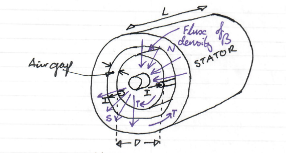
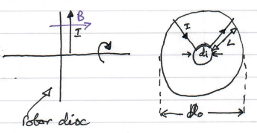

# Basic Machine Design

## Main Dimensions of Rotating Machines

{: .text-center }

$$L$$ - Active length of machine $$[m]$$

$$D$$ - Rotor Diameter $$[m]$$

$$I$$ - Conductor Current $$[A]$$

Force on 1 conductor: 

$$F=BIL$$

Where $$B$$ is the Magnetic Field Density $$[T]$$, and $$B$$ and $$I$$ are mutually perpendicular to $$F$$.

## Torque Produced

Force on 1 conductor: 

$$F=BIL$$

Torque produced:

$$T=F\frac{D}{2}$$

Torque produced by $$z$$ conductors:

$$T=B\frac{zILD}{2}$$

The Flux density $$B$$, varies over the range of $$0.3-1.2\;[T]$$, (see later).  $$B$$ is the magnetic loading. 

## Electrical Loading

The quantity $$zI$$ is variable over a large range, but by introducing the quantity   

$$Q=\frac{zI}{\pi D}\;[A.m^{-1}]$$

i.e. the number of Ampere conductors per meter of periphery;

Then $$Q$$ varies over a limited range of about $$10e3$$ to $$100e3\;[A/m]$$ or about $$10$$ to $$100\;[A/mm]$$ for continuous rating, (i.e. the machine operates continuously at this level).

For short durations, $$Q$$ can be increased by about 5 times.

For very large exotic machines, such as turbo alternators in power stations, $$Q$$ values  of $$300$$ to $$400\;[A/mm]$$ can be achieved 

## Torque and Power

Substituting $$Q$$ into $$T=B\frac{zILD}{2}$$ gives: 

$$T=\frac{\pi D^2 L}{2}BQ\;[N.m]$$

Hence Power, $$P=T\omega _r$$

The volume of the rotor cylinder is, $$V=\frac{\pi D^2 L}{4}\;[m^3]$$

Clearly:

$$T\;\alpha\;rotor\;active\;volume$$

$$P\;\alpha\;rotor\;active\;volume\;\times\;speed$$

To maximimise torque per rotor volume, we need to maximise $$BQ$$  

## Axial flux machines

{: .text-center }

An alternative topology is for the current to flow radially through an axial field.

Whereas $$D$$ and $$L$$ were independent in the previous analysis, now the active length of the conductor $$L$$ is:

$$L=\frac{D_0-D_i}{2}$$

Hence force on $$z$$ conductors, is:

$$T=zBI\frac{D_0-D_i}{2}$$

The mean radius is:

$$R_m=\frac{D_0+D_i}{4}$$

The torque is $$T=FR_m$$

$$T=zBI\left(\frac{D_0-D_i}{2}\right)\left(\frac{D_0+D_i}{4}\right)$$

Define electrical loading $$Q$$ as:

$$T=\frac{(D_0+D_i)^2(D_0-D_i)}{16}BQ\;[N.m]$$

## Notes on Axial flux machines

$$Q$$ varies from a maximum at the inner diameter to a minimum at the outer diameter.  Some texts use $$Q_{lim}=\frac{zI}{\pi D_i}\;[A.m^{-1}]$$ as the limiting value.

