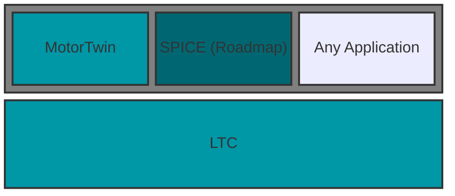

# The Linked Tool Chain
The Linked Tool Chain (LTC) from Tin Arm Engineering is a platform for the orchestration of long-running asynchonous chains of tasks.

Tasks are added and queried through a simple [RESTful API](https://api.ltc.tinarmengineering.com/docs/index.html){:target="_blank"}, and can be monitored through a Web STOMP feed.

Each task chain exists as an application on the LTC.

{: .text-center }


Tin Arm's first application, and the focus of this documentation, is MotorTwin; a multiphysics solver for the simulation of electric machines.

## Getting started

See the [examples]({{site.baseurl}}/examples).
```js
pip install ltc_client
```

